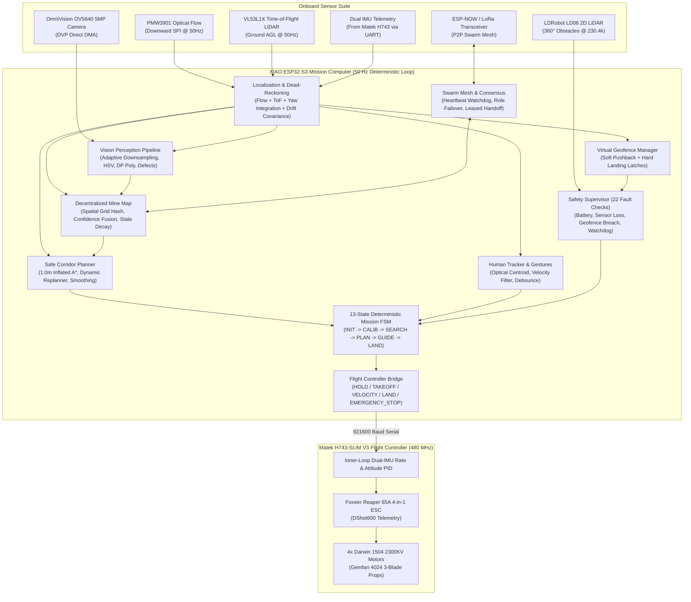

# Robofest Gujarat 6.0 — Autonomous Minefield Swarm Drone System

[](https://isocpp.org/)
[](https://platformio.org/)
[](https://docs.ros.org/)
[](LICENSE)
[](robofest_drone/tests/)

> **Fully Autonomous, GPS-Denied, Infrastructure-Free Search & Rescue Swarm Drone Platform for Landmine Detection, Safe Corridor Clearance, and Dynamic Human Guidance.**

---

## 1. The Core Idea & Mission Concept

### 1.1 The Humanitarian Problem & Challenge
Humanitarian demining and emergency search-and-rescue in hazardous conflict zones represent high-risk operations where human scouts face lethal danger. **Robofest Gujarat 6.0** mandates a fully autonomous swarm of unmanned aerial vehicles (UAVs) to eliminate human exposure during the critical scouting, mapping, and rescue phases.

The challenge takes place across a **$15.0\text{ m} \times 60.0\text{ m}$ operational arena** containing:
- **Start Zone ($0.0\text{ m} \le Y \le 1.0\text{ m}$)**: Deployment and human staging area.
- **Minefield Zone ($1.0\text{ m} \le Y \le 59.0\text{ m}$)**: Dangerous sector containing ~40 unknown landmines (surface-laid and shallow-buried markers) with arbitrary spatial distribution.
- **Exit Zone ($59.0\text{ m} \le Y \le 60.0\text{ m}$)**: Safe arrival boundary.
- **Mission Time Limit**: Strict **10-minute ($600.0\text{ s}$)** hard cutoff.

```
       X = 0.0 m                                             X = 15.0 m
Y = 60.0 m +=========================================================+
           |                    EXIT ZONE (1.0m)                     |
Y = 59.0 m +---------------------------------------------------------+
           |                                                         |
           |                  MINEFIELD SECTOR                       |
           |             (58.0m Length x 15.0m Width)                |
           |                                                         |
           |    [Drone 1: Scout Left]       [Drone 2: Scout Right]   |
           |       (Lawnmower X:0-7.5m)       (Lawnmower X:7.5-15m)  |
           |                                                         |
           |                   * (Mine Detection)                    |
           |             *                       *                   |
           |                    === Safe Path ===                    |
           |                         ^                               |
           |                 [Drone 3: Guide]                        |
           |                         ^                               |
           |                  (Human at Risk)                        |
Y = 1.0 m  +---------------------------------------------------------+
           |                    START ZONE (1.0m)                    |
Y = 0.0 m  +=========================================================+
```

### 1.2 Mission Objectives
1. **100% Onboard Autonomous Execution**: No remote pilot, no manual RC override, no cloud servers, and no ground control station (GCS). All computation runs on local drone hardware.
2. **GPS-Denied Dead-Reckoning**: Zero satellite navigation (GPS/GNSS), external motion capture (OptiTrack/Vicon), or ground beacons.
3. **Decentralized Swarm Collaboration**: $\ge 3$ cooperating drones executing synchronized lawnmower coverage, peer-to-peer (P2P) spatial mine map fusion, and dynamic role handoffs.
4. **Guaranteed $\ge 1.0\text{ m}$ Radial Clearance**: Real-time A* path computation ensuring the human never approaches closer than 1.0 meter to any confirmed mine.
5. **Human-in-the-Loop Escort & Adaptive Re-Routing**: Visual path projection, optical tracking of the person-at-risk, gesture/voice command understanding, and instant path invalidation/replanning if the human deviates or a new mine is uncovered.

---

## 2. System Architecture & Information Flow

The system employs a dual-tiered computing hierarchy on each drone:
1. **Companion Mission Computer (Seeed Studio XIAO ESP32-S3 Sense)**: High-level perception, state estimation, spatial costmap fusion, A* path planning, P2P RF mesh communication, human gesture decoding, and safety supervisory watchdog.
2. **Flight Controller (Matek H743-SLIM V3)**: Dual IMU sensor fusion (MPU6000 + ICM-42605), high-rate attitude stabilization, and motor mixing at 480 MHz, driven via high-speed 921600 baud UART setpoints.



---

## 3. Algorithmic Subsystems Deep Dive

### 3.1 Dead-Reckoning & Drift-Aware Localization
Because GPS is prohibited, position tracking $(x, y, z, \psi)$ relies on downward optical flow integrated with altitude and attitude:
$$\Delta x_{body} = \frac{(\Delta px - \omega_y \cdot f) \cdot h_{AGL}}{f \cdot \cos(\theta)}, \quad \Delta y_{body} = \frac{(\Delta py + \omega_x \cdot f) \cdot h_{AGL}}{f \cdot \cos(\phi)}$$
- **Body-to-Field Rotation**: Rotated into the global arena coordinate system via instantaneous yaw angle $\psi$.
- **Drift Covariance Modeling**: Drift uncertainty radius $\sigma_{drift}(t)$ grows linearly with accumulated distance and time, triggering station-keeping holds or altitude re-checks when threshold limits ($\ge 1.0\text{ m}$) are approached.

### 3.2 Vision Perception & Shape Classification
- **Aspect-Preserving Adaptive Downsampling**: 2x nearest-neighbor decimation (`FRAME_ADAPTER_USE_NEAREST_NEIGHBOR = true`) prevents bilinear blur from destroying small yellow mine marker edges.
- **Exposure Normalization & CLAHE**: Real-time tile-based Contrast-Limited Adaptive Histogram Equalization on the Value ($V$) channel ensures segmentation robustness under harsh sun or deep shadows.
- **Douglas-Peucker Boundary Analysis & Convexity Defects**: Differentiates circular surface landmines, square tags, star markers, and linear ground anomalies with sub-pixel centroid calculation.

### 3.3 Decentralized Spatial Mine Map & Consensus Fusion
- **Spatial Hash Grid ($0.1\text{ m}$ Cells)**: Prevents redundant allocations and ensures $O(1)$ spatial clustering.
- **Cross-Drone Bayesian Confidence Fusion**:
  $$C_{fused} = 1 - (1 - C_{local}) \cdot (1 - C_{peer} \cdot w_{dist})$$
  where $w_{dist} = \frac{1}{1 + (d / d_{ref})^2}$ discounts observations made from steep angles or high altitudes.
- **Stale Decay Filter**: Candidate detections unconfirmed by repeat observations decay over a $15.0\text{ s}$ half-life.

### 3.4 Safe Corridor Dynamic A* Path Planning
- **Obstacle Cost Inflation**: Every confirmed mine center $(x_m, y_m)$ receives an impenetrable hard obstacle radius:
  $$R_{obstacle} = R_{mine} + R_{clearance} = 0.15\text{ m} + 1.0\text{ m} = 1.15\text{ m}$$
- **8-Connected Grid with Corner-Cutting Prevention**: Prevents diagonal traversal across adjacent diagonal obstacles.
- **Dynamic Invalidation**: While in `GUIDING` state, if the human deviates off-path by $> 0.75\text{ m}$ or a new mine is registered within $1.0\text{ m}$ of the remaining trajectory, the path is instantly invalidated, commanding drone station-holding while A* computes a fresh detour corridor.

### 3.5 Peer-to-Peer Swarm Mesh & Acknowledged Task Handoff
- **Distributed Heartbeat & Role Arbitration**:
  - **SCOUT_LEFT** ($X \in [0, 7.5]\text{ m}$): Systematically scans left sector.
  - **SCOUT_RIGHT** ($X \in [7.5, 15]\text{ m}$): Systematically scans right sector.
  - **GUIDE_MARKER**: Hovers along safe path, projecting visual cues and tracking the human.
  - **RESERVE**: Loiters at staging perimeter, ready for hot-standby replacement.
- **Leased Guidance Handoff**: If the active guide drone reaches low battery ($< 20\%$), it issues an acknowledged P2P handoff request. A peer drone with $> 50\%$ battery accepts the lease, transitions to `GUIDE_MARKER`, and confirms before the retiring drone yields and initiates landing.

---

## 4. Hardware Architecture & Bill of Materials (BOM)

| Component | Selected Hardware Model | Key Specifications | Weight | Mission Role |
| :--- | :--- | :--- | :---: | :--- |
| **Mission Computer** | Seeed Studio XIAO ESP32-S3 Sense | Dual-Core Xtensa LX7 @ 240MHz, 8MB PSRAM, 8MB Flash | ~15 g | Perception, mapping, A* planner, P2P swarm mesh, safety manager |
| **Flight Controller** | Matek H743-SLIM V3 (2-8S) | STM32H743 @ 480MHz, 2MB Flash, **Dual IMU (MPU6000 + ICM-42605)** | 7 g | Inner-loop rate/attitude stabilization, vibration filtering, motor mixing |
| **ESC** | Foxeer Reaper F4 65A 4-in-1 | 65A Continuous / 100A Burst, DShot600, telemetry | 14.2 g | High-efficiency motor drive, low thermal resistance |
| **BLDC Motors** | Darwin 1504 2300KV | Micro brushless motor set for 4S efficiency | 47 g | High thrust-to-weight ratio for agile 4-inch frame |
| **Propellers** | Gemfan Hurricane 4024 | 4.0" diameter, 2.4" pitch 3-blade | 6.5 g | Low vibration, optimized for 2300KV on 4S |
| **Camera** | OmniVision OV5640 5MP | DVP parallel interface directly to ESP32-S3 DMA | ~5 g | Downward mine and surface marker HSV color blob segmentation |
| **Ground Distance** | Holybro ST VL53L1X LiDAR | $0.04\text{ m}$ to $4.0\text{ m}$ range, $50\text{ Hz}$ I2C | 8 g | Precision ground clearance and AGL altitude hold |
| **Obstacle Avoidance**| LDRobot LD06 2D LiDAR | $0.02\text{ m}$ to $12.0\text{ m}$ 360° range, $4500\text{ Hz}$ sampling, 230400 baud | 50 g | Forward/lateral obstacle detection (boundary poles, hazards) |
| **Battery** | Bonka 14.8V 2200mAh 35C LiPo / Molicel P28A 4S1P Li-ion | 4S1P 14.8V nominal (16.8V max, 14.4V low warning, 13.6V critical cutoff) | 215 g | 10+ minute hover mission endurance |
| **Airframe** | 4-inch Carbon Fiber Frame | Lightweight rigid unibody structure | 130 g | Total AUW: ~420 g |

---

## 5. Dual-Stack Software Implementation

This repository provides two complete, interoperable software environments:

### 5.1 Embedded C++17 Firmware (`robofest_drone/`)
- **Zero Dynamic Allocation**: Static arena allocation for all buffers; safe for real-time microcontrollers.
- **50 Hz Cooperative Scheduler**: Predictable task execution order with sub-millisecond jitter.
- **Configurable Per-Drone Targets**: Compile-time identities via PlatformIO (`env:drone_1`, `env:drone_2`, `env:drone_3`).

### 5.2 ROS 2 Workspace (`ros2_ws/`)
- **Node Stack**:
  - `robofest_perception`: Camera ingest, OpenCV color segmentation, and candidate extraction.
  - `robofest_navigation`: Global mine map maintenance, A* safe corridor calculation, and trajectory generation.
  - `robofest_drivers`: MAVROS velocity bridge, hardware watchdog, and serial transceivers.
  - `robofest_bringup`: Launch scripts and Gazebo/SITL multi-drone world generators.

---

## 6. Repository Directory Structure

```text
robofest-algo/
├── README.md                           # Master system overview and architecture guide
├── docs/                               # System documentation & ROS 2 MAVROS specifications
│   └── mavros_swarm_and_dynamic_planning.md
├── robofest_drone/                     # Embedded C++17 firmware for Seeed Studio XIAO ESP32-S3
│   ├── platformio.ini                  # PlatformIO configuration with per-drone build targets
│   ├── config/
│   │   ├── camera_intrinsics.h         # Camera focal length and lens distortion parameters
│   │   ├── mission_config.h            # Arena geometry, 4S battery limits, and drone identity
│   │   ├── thresholds.h                # Algorithmic gains, filter cutoffs, and safety limits
│   │   └── vision_profiles.h           # HSV color bands and shape descriptors
│   ├── hal/                            # Hardware Abstraction Layer
│   │   ├── hal_camera.h/.cpp           # OV5640 DMA camera driver
│   │   ├── hal_optical_flow.h/.cpp     # PMW3901 downward SPI optical flow driver
│   │   ├── hal_tof.h/.cpp              # Holybro ST VL53L1X I2C LiDAR driver
│   │   ├── hal_lidar.h/.cpp            # LDRobot LD06 2D LiDAR driver
│   │   ├── hal_serial.h/.cpp           # Matek H743 UART bridge @ 921600 baud
│   │   ├── hal_radio.h/.cpp            # P2P mesh RF driver
│   │   ├── hal_gpio.h/.cpp             # Hardware kill switch interface
│   │   ├── hal_storage.h/.cpp          # LittleFS flash blackbox event logger
│   │   ├── hal_command.h/.cpp          # Hand gesture & voice command interface
│   │   ├── hal_human.h/.cpp            # Human detection sensor interface
│   │   └── hal_marker.h/.cpp           # WS2812B guidance LED / marker optical output
│   ├── src/                            # Core Algorithmic Engine
│   │   ├── main.cpp                    # Bootstrap entry point and 50 Hz scheduler
│   │   ├── localization.h/.cpp         # Optical flow dead-reckoning & drift tracking
│   │   ├── geofence.h/.cpp             # Virtual arena boundary enforcement
│   │   ├── vision_pipeline.h/.cpp      # Real-time HSV segmentation & circularity filter
│   │   ├── shape_analysis.h/.cpp       # Douglas-Peucker polygon & convexity defect classification
│   │   ├── frame_adapter.h/.cpp        # Nearest-neighbor adaptive resolution downsampler
│   │   ├── image_enhance.h/.cpp        # CLAHE, dehazing, and exposure normalization
│   │   ├── mine_map.h/.cpp             # Spatial hash grid, confidence fusion, and decay
│   │   ├── path_planner.h/.cpp         # 1.0 m mine clearance A* corridor search & replanner
│   │   ├── swarm_comm.h/.cpp           # P2P heartbeats, role failover, and leased handoffs
│   │   ├── command_layer.h/.cpp        # Gesture debouncing, confidence gating, and lockout
│   │   ├── human_tracker.h/.cpp        # Person tracking and corridor deviation detection
│   │   ├── search_behavior.h/.cpp      # Lawnmower lane coverage & peer separation
│   │   ├── safety_manager.h/.cpp       # Multi-fault supervisor & latched emergency stops
│   │   ├── fc_bridge.h/.cpp            # Setpoint serialization for Matek H743
│   │   ├── telemetry.h/.cpp            # Circular RAM buffer & flash event flusher
│   │   └── state_machine.h/.cpp        # 13-state deterministic mission state machine
│   ├── tests/                          # Offline host C++ unit test suite (17/17 passing)
│   │   ├── test_main.cpp               # Test runner
│   │   ├── test_geofence.cpp           # Geofence boundary tests
│   │   ├── test_path_clearance.cpp     # 1.0m radial clearance geometry tests
│   │   ├── test_mine_dedup.cpp         # Spatial deduplication & decay tests
│   │   ├── test_localization_math.cpp  # Optical flow velocity & yaw integration tests
│   │   ├── test_cv_e2e.cpp             # End-to-end computer vision pipeline tests
│   │   └── test_swarm_phase5.cpp       # P2P mesh & role failover tests
│   └── sim/                            # Software-In-The-Loop (SITL) simulator suite
│       ├── sitl_harness.py             # Closed-loop multi-agent simulator
│       ├── score_eval.py               # Official score calculator & report generator
│       ├── map_generator.py            # Synthetic arena & minefield generator
│       └── calibrate_camera.py         # OpenCV checkerboard camera calibration tool
└── ros2_ws/                            # Complete ROS 2 Workspace (Colcon / MAVROS)
    └── src/
        ├── robofest_bringup/           # Multi-drone launch scripts & parameters
        ├── robofest_drivers/           # MAVROS velocity bridge & watchdog nodes
        ├── robofest_interfaces/        # Custom messages (MineMap, SwarmState, etc.)
        ├── robofest_navigation/        # ROS 2 A* planner & map fusion nodes
        └── robofest_perception/        # ROS 2 image pipeline & detection nodes
```

---

## 7. How to Build, Test & Run

### 7.1 Running Offline C++ Host Unit Tests (GCC / Clang)
Execute the complete algorithmic test suite on your local host (Linux, macOS, or Windows MinGW):
```bash
cd robofest_drone
g++ -std=c++17 -Wall -Wextra -I./src -I./hal -I./config \
    tests/*.cpp \
    src/vision_pipeline.cpp src/geofence.cpp src/path_planner.cpp \
    src/mine_map.cpp src/command_layer.cpp src/telemetry.cpp \
    src/shape_analysis.cpp src/frame_adapter.cpp src/image_enhance.cpp \
    src/mem.cpp src/profiler.cpp src/undistort.cpp src/profile_store.cpp \
    src/gesture_engine.cpp src/human_detector.cpp src/buried_detector.cpp \
    src/threat_arbiter.cpp src/marker_controller.cpp src/code_reader.cpp \
    src/human_tracker.cpp src/swarm_comm.cpp src/state_machine.cpp \
    src/mission_integration.cpp src/safety_manager.cpp src/fc_bridge.cpp \
    src/search_behavior.cpp src/localization.cpp src/scheduler.cpp \
    src/calibration/hsv_tuner.cpp \
    hal/*.cpp \
    -o robofest_unit_tests.exe

./robofest_unit_tests.exe
```

### 7.2 Building and Flashing Microcontroller Firmware (PlatformIO)
Flash individual drones with their respective identities:

```bash
cd robofest_drone

# Drone 1 (SCOUT_LEFT):
pio run -e drone_1 --target upload

# Drone 2 (SCOUT_RIGHT):
pio run -e drone_2 --target upload

# Drone 3 (GUIDE_MARKER):
pio run -e drone_3 --target upload

# Open Serial Diagnostic Monitor at 115200 baud:
pio device monitor --baud 115200
```

### 7.3 Running SITL Swarm Simulation & Score Evaluation
Test multi-agent search efficiency and mission scoring using the Python SITL harness:
```bash
cd robofest_drone

# 1. Run Nominal 3-Drone Mission Simulation (40 mines, 600s):
python sim/sitl_harness.py --seed 1 --scenario nominal_map --drones 3 --mines 40 --duration 600 --output run_nominal.json --report run_nominal.md

# 2. Run High-Density Stress Test (60 mines, 4 drones):
python sim/sitl_harness.py --seed 42 --scenario dense_map --drones 4 --mines 60 --duration 600 --output run_dense.json --report run_dense.md

# 3. Generate Official Competition Score Breakdown:
python sim/score_eval.py run_nominal.json --report run_nominal_score.md
```

### 7.4 Building the ROS 2 Workspace
```bash
cd ros2_ws
colcon build --symlink-install
source install/setup.bash

# Launch full swarm simulation stack:
ros2 launch robofest_bringup swarm_simulation.launch.py
```

---

## 8. Safety & Operational Directives

> [!CAUTION]
> **PRE-FLIGHT BENCH SAFETY MANDATE**:
> 1. **REMOVE ALL PROPELLERS** during bench testing, firmware flashing, and UART communication verification.
> 2. Always verify that the physical kill switch on `KILL_SWITCH_PIN` (GPIO 0) immediately commands `EMERGENCY_STOP` and disarms the flight controller before attaching propellers.
> 3. Verify battery voltage is above $16.0\text{ V}$ (4S) prior to initiating autonomous takeoff.

---

## 9. Contributors & Competition Credits

- **Team**: Robofest Gujarat 6.0 Autonomous Aerial Robotics Team
- **Competition**: Robofest Gujarat 6.0 — Autonomous Minefield Swarm Search and Rescue
- **Repository**: [https://github.com/siddhpararudra2-debug/robofest-algo.git](https://github.com/siddhpararudra2-debug/robofest-algo.git)
